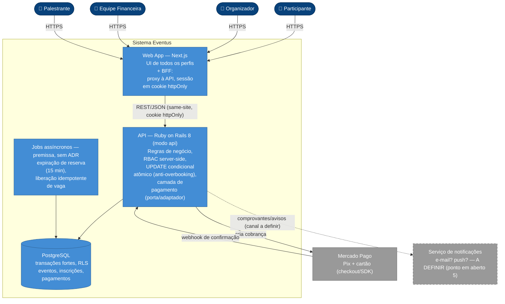
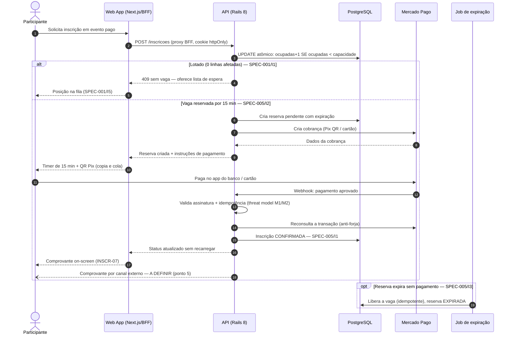
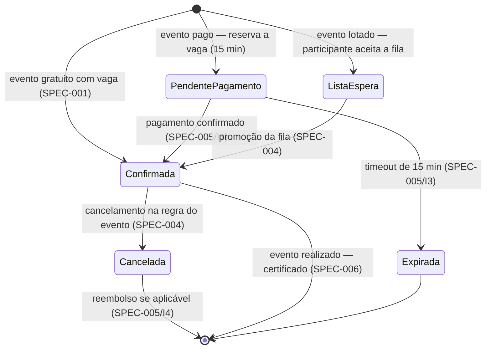

# Sistema de Gestão de Eventos — Eventus

> Trabalho prático da pós-graduação em **Engenharia de Software com IA — UFG**.
> Projeto conduzido com a fábrica de agentes **[kairos-forge](https://github.com/vilelaAI/kairos-forge)** (spec-driven development assistido por IA).

A **Eventus** organiza congressos, workshops e eventos corporativos. Hoje o gerenciamento de inscrições é feito com formulários on-line e planilhas, o que dificulta o controle de vagas, pagamentos, cancelamentos e emissão de certificados. Este projeto centraliza essas atividades em um sistema próprio.

Este repositório documenta o ciclo completo de **engenharia de requisitos → arquitetura → segurança → design → início de implementação**, com todos os artefatos rastreáveis.

## Status atual

| Etapa | Estado |
|---|---|
| Elicitação de requisitos | ✅ (`elicitacao.txt`) |
| Especificação (10 SPECs + RNF) | ✅ `docs/specs/` |
| Decisões arquiteturais (3 ADRs) | ✅ `docs/adr/` |
| Modelos de ameaças (pagamento, auth) | ✅ `docs/seguranca/` |
| Handoff de design (SPEC-002) | ✅ `docs/design/` |
| Grafo de conhecimento | ✅ `.agents/grafo/` |
| Documentação visual (*diagrams as code*) | ✅ [seção abaixo](#-documentação-do-sistema--diagrams-as-code) |
| Implementação | 🚧 iniciando pela SPEC-002 (fundacional) |

## Stakeholders

- **Participantes** — inscrevem-se, acompanham inscrições, cancelam e emitem certificados.
- **Organizadores** — criam eventos, controlam vagas e gerenciam participantes.
- **Equipe Financeira** — confirma pagamentos e controla reembolsos.
- **Palestrantes** — consultam programação e participantes de suas atividades.
- **Equipe de TI** — desenvolve e mantém o sistema.

## Stack (ADR-0001, ADR-0002, ADR-0003)

| Camada | Escolha |
|---|---|
| Backend / API | Ruby on Rails 8 (`--api`) |
| Frontend | Next.js (React + TypeScript) |
| Banco | PostgreSQL |
| Autenticação | Rails nativo (`has_secure_password` + Session), cookie httpOnly + BFF |
| Pagamento | Mercado Pago (Pix + cartão) |
| Empacotamento | Docker |

## Estrutura do repositório

```
.
├── elicitacao.txt          # Documento de elicitação (fonte de requisitos)
├── CLAUDE.md               # Instruções do projeto para agentes de IA
├── contextos/              # Contexto persistente (sobre, stack, convenções, restrições, testes)
├── decisoes/               # Log de decisões, estado operacional e auditorias
├── docs/
│   ├── specs/              # SPECs rastreáveis (SPEC-001..009 + RNF-001)
│   ├── adr/                # Architecture Decision Records
│   ├── design/             # Handoff de design (DESIGN-NNN)
│   └── seguranca/          # Modelos de ameaças (AMEACAS-*)
├── .agents/grafo/          # Grafo de conhecimento do projeto (entidades + relações)
├── api/                    # Backend Rails (em construção)
└── web/                    # Frontend Next.js (em construção)
```

## Requisitos e rastreabilidade

As SPECs usam requisitos com ID estável, prioridade e critério de aceite verificável no formato `WHEN … THEN … SHALL …`. Cada feature nasce de uma SPEC, é desenhada (quando tem UI), tem suas ameaças modeladas (quando é sensível) e é validada contra a SPEC antes da revisão.

| SPEC | Feature |
|---|---|
| SPEC-001 | Inscrição em evento com controle de vagas e lista de espera |
| SPEC-002 | Gestão de eventos pelo organizador (fundacional) |
| SPEC-003 | Catálogo de eventos |
| SPEC-004 | Cancelamento de inscrição e promoção da lista de espera |
| SPEC-005 | Pagamento, confirmação e reembolso |
| SPEC-006 | Emissão de certificado |
| SPEC-007 | Notificações e comprovantes |
| SPEC-008 | Painel do palestrante |
| SPEC-009 | Autenticação e papéis (RBAC) |
| RNF-001 | Requisitos não-funcionais (segurança, desempenho, disponibilidade, acessibilidade, privacidade/LGPD) |

## 📐 Documentação do sistema — *diagrams as code*

> Atividade da **Unidade III** — discovery de documentação com diagramas como código: a descrição do sistema em linguagem natural, os diagramas **Mermaid** gerados com apoio de GenAI e as decisões/ajustes feitos sobre o que o modelo gerou. Por estarem em código, os diagramas são versionados, revisáveis em PR e renderizam nativamente no GitHub — e servem de contexto para agentes de desenvolvimento implementarem o sistema com aderência à arquitetura documentada.

### Descrição do sistema (linguagem natural)

**Escopo.** O Eventus centraliza o ciclo de participação em eventos: catálogo e criação de eventos, inscrição com controle automático de vagas e lista de espera, pagamento de eventos pagos, cancelamento com reembolso conforme a política do evento, emissão de certificados, notificações/comprovantes e painéis por perfil (participante, organizador, financeiro, palestrante). **Fora do escopo do MVP:** boleto (ADR-0003), nota fiscal/conciliação contábil, MFA/SSO (ADR-0002) e apps móveis nativos.

**Nível da visão.** Os diagramas estruturais seguem a **visão de containers do C4** (nível 2): mostram as unidades executáveis/implantáveis e suas integrações — não classes nem componentes internos. O diagrama comportamental desce ao nível de interação entre esses containers na jornada mais crítica do sistema.

**Limites e responsabilidades.**

- **Web App (Next.js)** — interface de todos os perfis **e BFF**: as rotas do Next fazem proxy à API e mantêm a sessão em cookie `httpOnly`/same-site; nenhum token fica acessível a JavaScript (ADR-0002).
- **API (Rails 8, modo `--api`)** — dona das regras de negócio: RBAC server-side com policy objects (SPEC-009), invariantes de inscrição — sem overbooking via `UPDATE` condicional atômico (SPEC-001/I1, ratificado no ADR-0001) — e fluxo de pagamento isolado atrás de porta/adaptador (ADR-0003).
- **Jobs assíncronos** — expiração da reserva de vaga (15 min) com liberação idempotente (SPEC-005/I3). *Premissa: o executor (Solid Queue? cron?) ainda não tem ADR.*
- **PostgreSQL** — única fonte de verdade; transações fortes para vaga/pagamento e RLS para isolamento por papel (ADR-0001).

**Integrações.**

- **Mercado Pago** (Pix + cartão): a API cria a cobrança e a confirmação chega **via webhook**, com validação de assinatura, reconsulta da transação e idempotência (ADR-0003 + threat model `AMEACAS-pagamento`).
- **Serviço de notificações** (e-mail? push?): integração **prevista porém indefinida** — o canal de envio de comprovantes é o ponto em aberto nº 5 da elicitação. Aparece **tracejado** nos diagramas, deliberadamente.

**Restrições.**

- **LGPD/privacidade** — o sistema trata dados pessoais e financeiros; quais dados o palestrante enxerga ainda não foi definido (ponto nº 8); minimização e proibição de logar dado sensível (RNF-001).
- **Sem overbooking** mesmo sob inscrições concorrentes (SPEC-001/I1) — invariante que condicionou a escolha do banco.
- **Inscrição paga só confirma após pagamento confirmado** (SPEC-005/I1); vaga reservada conta como ocupada até confirmar ou expirar (I2).
- **Autorização sempre server-side** — o front nunca decide permissão (SPEC-009/I2).

**Lacunas conhecidas** (o que os diagramas *não* podem afirmar):

- Canal/formato de notificações (ponto 5) e dados do participante visíveis ao palestrante (ponto 8).
- **Hospedagem/topologia de deploy** — sem ADR; por isso os diagramas param no limite dos containers (sem nós de infraestrutura).
- Executor de jobs assíncronos — inferido das SPECs, marcado como premissa.
- Números de RNF (latência, disponibilidade) são premissas a confirmar (RNF-001).
- Contrato **OpenAPI** da API ainda não escrito (previsto no ADR-0001).

### Diagrama estrutural — visão de containers (inspirada no C4)

Convenção de cores no estilo C4: azul-escuro = pessoas, azul = containers do sistema, cinza = sistemas externos, **tracejado = integração ainda não decidida**.



> O webhook do Mercado Pago exige assinatura validada, reconsulta da transação e idempotência (mitigações M1/M2 do threat model de pagamento) — detalhado no diagrama de sequência abaixo.

### Diagrama comportamental — sequência da jornada crítica

Jornada escolhida: **inscrição em evento pago com Pix**. É a que atravessa o maior número de decisões registradas (reserva atômica de vaga, timeout de 15 min, webhook seguro) e onde o sistema pode perder dinheiro ou vaga se errar.



### Bônus — ciclo de vida de uma inscrição

Um terceiro diagrama (também comportamental) que amarra as SPECs entre si: cada transição cita a SPEC que a especifica.



### O que a IA gerou × o que eu decidi

**O modelo inferiu corretamente** (lendo `elicitacao.txt`, as SPECs e os ADRs deste repositório):

- A separação **Web/BFF ↔ API ↔ banco** com sessão em cookie `httpOnly` — leu o ADR-0002 e não caiu no padrão comum de "JWT no localStorage".
- O **`UPDATE` condicional atômico** como mecanismo anti-overbooking e a **reserva com timeout de 15 min** contando como vaga ocupada.
- O trio de segurança do webhook (**assinatura + reconsulta + idempotência**), extraído do threat model de pagamento.
- Que a jornada crítica era a de **evento pago**, não a de evento gratuito — é onde as invariantes I1–I3 da SPEC-005 se encontram.

**O que precisei ajustar:**

1. **Sintaxe `C4Container` → `flowchart`.** A primeira versão veio na sintaxe C4 nativa do Mermaid; troquei por `flowchart` com subgraph e classes de estilo, porque o suporte C4 do Mermaid é experimental e o layout renderizado (inclusive no GitHub) sai com caixas sobrepostas. Mantive a **semântica** C4 (pessoas / containers / sistemas externos) via convenção de cores.
2. **Removi um cache Redis** que o modelo adicionou "para o contador em tempo real do organizador" — nenhum ADR decidiu isso; o mecanismo do contador é a pergunta aberta SPEC-001/Q-01. Diagrama não é lugar de decisão nova.
3. **Rebaixei o serviço de e-mail** de fato consumado para **container tracejado "a definir"** — o canal de notificações é o ponto em aberto nº 5 da elicitação; o modelo tinha assumido e-mail transacional como certo.
4. **Removi o boleto** da primeira versão da sequência de pagamento (fora do MVP por decisão registrada — ADR-0003).
5. **Mantive os jobs assíncronos, mas rotulados como premissa sem ADR** — a expiração de reserva exige um executor, então o container é implicado pela SPEC-005, não decidido.
6. **Amarrei cada elemento a um ID rastreável** (SPEC/invariante/ADR/threat model) nos rótulos — o diagrama vira auditável contra a documentação, e um agente consegue navegar do desenho para a especificação.

**O que a documentação ainda precisaria ter para um agente construir sem inventar decisões:**

- **ADR de hospedagem/deploy** — hoje qualquer agente teria que inventar a topologia de produção.
- **Contrato OpenAPI** da API Rails — rotas, payloads e códigos de erro (o diagrama de sequência insinua, não especifica).
- **ADR do executor de jobs** (Solid Queue vs. cron vs. outro) e da estratégia do contador em tempo real (SPEC-001/Q-01: polling vs. push).
- **Decisões de negócio pendentes:** canal/formato de notificações (ponto 5), dados do participante visíveis ao palestrante (ponto 8 — LGPD), taxa do gateway no reembolso (SPEC-005/Q-04) e prazo de reembolso default (Q-05).
- **Números de RNF confirmados** — latências, disponibilidade e metas de acessibilidade hoje são premissas.
- **Modelo de dados (ERD)** como próximo diagrama estrutural, um nível abaixo desta visão de containers.

## Como rodar (quando a implementação estiver disponível)

```bash
# Backend
cd api && bundle install && bin/rails db:prepare && bin/rails server

# Frontend
cd web && npm install && npm run dev
```

Gates de qualidade em `contextos/testes.md`.

## Licença

Projeto acadêmico — UFG, pós-graduação em Engenharia de Software com IA.
