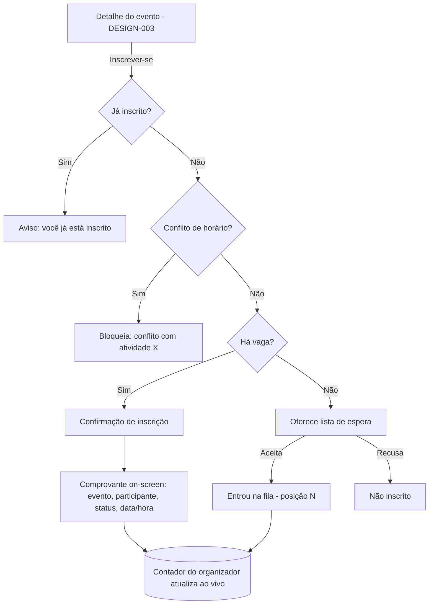

# DESIGN-001 — Jornada de inscrição (da SPEC-001)

> Conduzido por Isabela (UX), com Pablo (UI) e Ada (Acessibilidade).
> **Base:** herda `DESIGN-000` (tokens, componentes, a11y global, VG-xx, regra dos 5 estados).
> **SPEC:** SPEC-001 · **Escopo:** ação de inscrição do participante, comprovante, lista de espera, conflito de horário e contador em tempo real do organizador.

## Fluxos

## Estados — por view (únicos desta feature)

| View | Carregando | Vazio | Erro | Sucesso | Parcial |
|---|---|---|---|---|---|
| **Ação de inscrição** (confirmação) | Botão "Inscrever-se" em loading ao processar | — (sempre parte de um evento) | Conflito de horário → mensagem nomeando a atividade em choque, **não inscreve**; inscrição duplicada → aviso "você já está inscrito" | "Inscrição confirmada" → abre comprovante | Verificando vaga/conflito antes de confirmar |
| **Comprovante** (INSCR-07) | — | — | Falha ao gerar → mensagem + "tentar de novo" | Cartão com evento, participante, **status CONFIRMADA**, data/hora; ação "baixar/imprimir" | — |
| **Lista de espera** (INSCR-03) | Skeleton do bloco de posição | — | Falha ao entrar na fila → mensagem | "Você está na lista de espera — **posição N**" + o que acontece se abrir vaga `[texto: Celina]` | Entrando na fila (botão loading) |
| **Contador ao vivo** (INSCR-06, organizador) | Skeleton do número | Evento sem inscritos → "0 inscritos" | Falha ao atualizar → último valor + aviso discreto | `ocupadas/capacidade` atualizando **sem recarregar** (`aria-live`) | — |

## Responsivo (o que difere da fundação)

- **Mobile:** a ação de inscrição e o comprovante ocupam tela cheia; o comprovante prioriza status + evento no topo.
- O contador do organizador aparece junto ao evento na lista (herda a tabela/card do DESIGN-002).

## Acessibilidade específica

- **Conflito de horário** e **lotado** são anunciados por `aria-live` (o participante que navega por teclado/leitor precisa saber por que não inscreveu).
- **Contador ao vivo** usa `aria-live="polite"` — nunca "rouba" o foco.
- Comprovante é conteúdo estático focável e legível por leitor de tela; "baixar/imprimir" tem nome acessível.

## Componentes novos (além do DESIGN-000)

| Componente | Justificativa |
|---|---|
| **CartãoComprovante** | Confirmação estruturada de inscrição (reusável no e-mail/PDF futuro) |
| **IndicadorPosiçãoFila** | Mostra posição na lista de espera |
| **ContadorAoVivo** | Número com `aria-live` para o organizador (reusa base) |

## Critérios de aceite visuais

| ID | Critério verificável | Como verificar |
|---|---|---|
| V-01 | Inscrição com vaga confirma e exibe comprovante on-screen (evento, participante, status, data) | Inscrever em evento com vaga |
| V-02 | Evento lotado oferece lista de espera e mostra a posição N | Inscrever em evento cheio; aceitar a fila |
| V-03 | Conflito de horário bloqueia e nomeia a atividade em choque; não inscreve | Inscrever em atividade que colide com outra confirmada |
| V-04 | Tentativa de inscrição duplicada é avisada e não duplica | Inscrever duas vezes no mesmo evento |
| V-05 | Contador do organizador atualiza sem recarregar e anuncia via `aria-live` | Inscrever com o painel do organizador aberto |
| V-06 | Vagas restantes visíveis antes de confirmar a inscrição | Abrir a ação de inscrição |

## Premissas

- **P-01:** comprovante **on-screen** é o escopo desta SPEC; envio por canal externo é SPEC-007 (fora).
- **P-02:** entrada na lista de espera aqui; **promoção** (quando abre vaga) é DESIGN/​SPEC-004.
- **P-03:** o "tempo real" do contador segue a decisão técnica da SPEC-001/Q-01 (polling vs push) — o design é agnóstico, exige só que atualize sem recarregar.

## Próximo passo

- Anexar V-01..V-06 à SPEC-001 (Caio).
- Implementação junto do Épico E4; verificar com `/kairos-forge:desenhar verificar DESIGN-001`.
