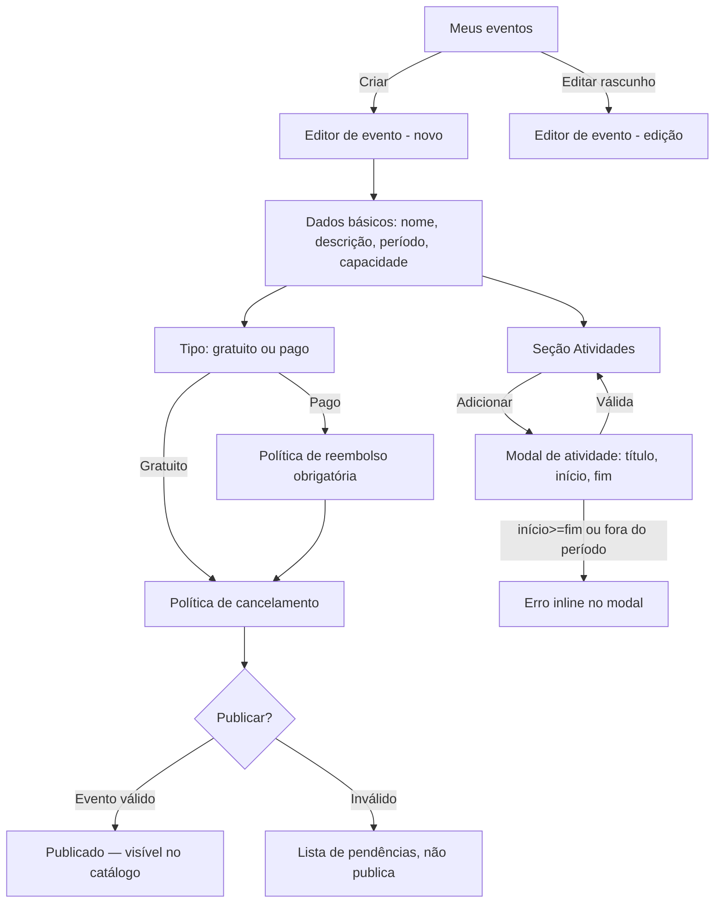

# DESIGN-002 — Gestão de eventos (da SPEC-002)

**Conduzido por:** Isabela (UX), com Pablo (UI) e Ada (Acessibilidade).
**SPEC:** SPEC-002 · **Stack:** Next.js (ADR-0001) consumindo a API Rails.
**Escopo:** telas do organizador para criar/editar eventos, cadastrar atividades com horário, definir políticas e publicar.

## Fluxos

Jornada principal do organizador: da lista dos seus eventos até publicar um evento válido.

Regra de saída de cada tela: da **lista** o organizador só cria ou edita rascunho; do **editor** ele salva rascunho a qualquer momento e só publica quando válido (EVT-06/EVT-08).

## Estados — obrigatório por view

| View | Carregando | Vazio | Erro | Sucesso | Parcial |
|---|---|---|---|---|---|
| **Meus eventos** (lista) | Skeleton de tabela/cards, 6 linhas | Nenhum evento → ilustração + CTA "Criar primeiro evento" `[texto: Celina]` | Falha ao carregar → mensagem + botão "Tentar de novo" `[texto: Celina]` | Lista com título, período, **badge de status** (rascunho/publicado) e **contador de lotação** (`ocupadas/capacidade`) | Paginação: "carregar mais" com skeleton nas novas linhas |
| **Editor de evento** | Skeleton do formulário (ao editar existente) | Novo evento: formulário em branco com defaults (capacidade vazia, tipo=gratuito) | Erro de validação por campo (associado ao campo) + resumo no topo | Toast "Evento salvo" `[texto: Celina]`, permanece no editor com estado salvo | Botão "Salvar" em loading; seção Atividades pode carregar à parte |
| **Modal de atividade** | — (abre instantâneo) | Formulário novo: título, início, fim vazios | Erro inline: `fim ≤ início` ou fora do período do evento → **não fecha o modal** | Atividade adicionada à lista do editor, modal fecha, foco volta ao botão "Adicionar" | Botão "Adicionar" em loading ao salvar |
| **Publicação** | "Validando evento…" ao acionar publicar | — | Evento inválido → **lista de pendências** (capacidade, período, política de reembolso se pago) `[texto: Celina]`; não publica | Badge muda para "Publicado"; toast de confirmação | "Publicando…" com botão desabilitado |

Todo estado Vazio tem ação de saída explícita (CTA). "Spinner" isolado não é aceito — cada carregamento usa skeleton específico da sua estrutura.

## Responsivo

| Breakpoint | Meus eventos | Editor |
|---|---|---|
| **Desktop (≥1024px)** | Tabela com colunas (nome, período, status, lotação, ações) | Formulário em 2 colunas; seção Atividades como tabela |
| **Tablet (640–1023px)** | Tabela compacta; ações em menu "…" | Formulário em 1 coluna; atividades em lista |
| **Mobile (<640px)** | Cada evento vira **card** (título, badge, lotação, ação primária) | 1 coluna, campos full-width; atividades em lista vertical; modal ocupa tela cheia; ações fixas no rodapé |

O que colapsa no mobile: colunas secundárias da tabela viram linhas do card; ações secundárias entram em menu.

## Acessibilidade (Ada)

Critérios verificáveis (não intenções):

- **Foco visível** em todos os interativos, com indicador de contraste ≥ 3:1.
- **Ordem de tabulação** segue a ordem visual: lista → ações; no editor, campo a campo até "Salvar/Publicar".
- **Labels e aria:** todo campo tem `<label>` associado; erro de campo ligado por `aria-describedby`; o resumo de erro no topo recebe foco ao falhar o submit.
- **Modal de atividade:** `role="dialog"` com `aria-modal`, **foco preso** dentro do modal, `Esc` fecha, **foco retorna** ao botão que o abriu.
- **Contraste:** texto e badges de status ≥ 4,5:1; status **nunca** comunicado só por cor (badge tem rótulo textual).
- **Alvo de toque:** ações primárias ≥ 44×44px.
- **Campos de data/hora:** acessíveis por teclado e leitor de tela; formato esperado anunciado.

## Componentes (Pablo)

⚠️ **O projeto ainda não tem design system.** Todos os componentes abaixo **nascem novos** — recomendo uma tarefa fundacional de **tokens (cores, tipografia, espaçamento) + componentes base** antes/junto da implementação, para não espalhar estilos soltos.

| Componente | Novo? | Justificativa |
|---|---|---|
| Button (primário/secundário/perigo) | Novo | Base do sistema |
| FormField (label + input + erro) | Novo | Padroniza validação acessível |
| Input / Textarea / Select | Novo | Formulário de evento |
| DateTimePicker | Novo | Período do evento e horários de atividade (acessível) |
| Toggle (gratuito/pago, publicar) | Novo | Estados binários |
| Card (evento no mobile) | Novo | Lista responsiva |
| DataTable / DataList | Novo | Lista de eventos e de atividades |
| Badge de status | Novo | Rascunho/Publicado + lotação |
| Modal/Dialog | Novo | Cadastro de atividade (com foco preso) |
| Toast | Novo | Feedback de salvar/publicar |
| EmptyState | Novo | Estado vazio da lista |
| Skeleton | Novo | Estados de carregamento |

## Critérios de aceite visuais

Entram na SPEC-002 como requisitos rastreáveis (via Caio) e o `/kairos-forge:desenhar verificar` os cobra.

| ID | Critério verificável | Como verificar |
|---|---|---|
| V-01 | Lista vazia mostra CTA "Criar primeiro evento" visível e focável | Abrir conta sem eventos; tabular até o CTA |
| V-02 | Salvar com `capacidade ≤ 0` é bloqueado e o erro aparece ligado ao campo | Enviar capacidade 0; inspecionar `aria-describedby` |
| V-03 | Atividade com `fim ≤ início` mostra erro inline e o modal não fecha | Preencher fim antes do início; tentar salvar |
| V-04 | Publicar evento inválido lista as pendências e não publica | Publicar evento pago sem política de reembolso |
| V-05 | Cada carregamento usa skeleton específico (não spinner genérico) | Throttle de rede; observar lista e editor |
| V-06 | Badge de status e contador de lotação visíveis na lista | Ver evento publicado com inscritos |
| V-07 | Modal de atividade prende o foco e o devolve ao fechar | Navegar por teclado ao abrir/fechar o modal |
| V-08 | Contraste AA (≥4,5:1) em textos e badges; status não é só cor | Medir contraste; conferir rótulo textual do badge |
| V-09 | Alvos de toque ≥44px nas ações primárias | Inspecionar tamanho no mobile |
| V-10 | Fluxo criar evento → adicionar atividade → publicar é 100% navegável por teclado | Percorrer sem mouse |

## Premissas assumidas

- **P-01:** idioma único **PT-BR** nesta versão (sem i18n; Ingrid não acionada). Reavaliar se surgir requisito multi-idioma.
- **P-02:** atividades são editadas via **modal** a partir do editor (não em página separada) — reduz troca de contexto; reversível.
- **P-03:** horários exibidos no **fuso do evento** (herda Q-02 da SPEC-001, a confirmar).
- **P-04:** capacidade só é editável enquanto o evento está em **rascunho** (herda SPEC-002/Q-02).
- **P-05:** todo texto de interface marcado `[texto: Celina]` é pendência de microcopy — não inventar antes da revisão da Celina.

## Próximo passo

- Os critérios V-01..V-10 devem ser anexados à SPEC-002 como requisitos rastreáveis (Caio).
- Implementação: `/kairos-forge:mobilizar SPEC-002` — começar pela fundação de tokens/componentes base (Pablo) antes das telas.
- Depois de implementado: `/kairos-forge:desenhar verificar DESIGN-002`.
