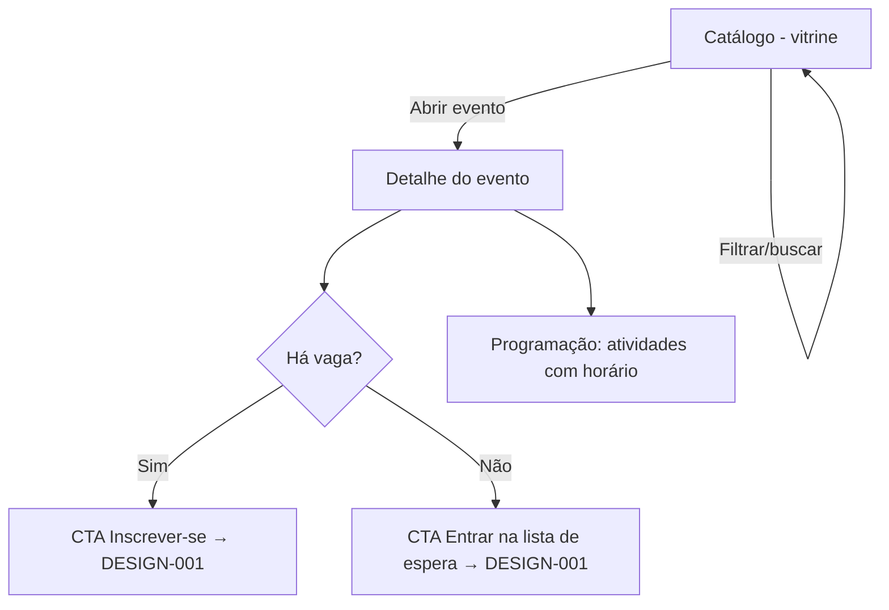

# DESIGN-003 — Catálogo de eventos (da SPEC-003)

> Conduzido por Isabela (UX), com Pablo (UI), Ada (Acessibilidade) e André (busca).
> **Base:** herda `DESIGN-000`. **SPEC:** SPEC-003.
> **Escopo:** vitrine de eventos publicados, detalhe do evento e filtro/busca. É a porta de entrada do participante (leva à inscrição — DESIGN-001).

## Fluxos

## Estados — por view

| View | Carregando | Vazio | Erro | Sucesso | Parcial |
|---|---|---|---|---|---|
| **Vitrine** (lista) | Skeleton de grade de cards, 6 itens | Nenhum evento publicado → "Nenhum evento disponível no momento" `[texto: Celina]` (sem CTA de criação — é visão do participante) | Falha ao carregar → mensagem + "tentar de novo" | Grade de cards: título, período, **vagas restantes** ou **badge "Lotado"**, tipo (gratuito/pago) | "Carregar mais"/paginação com skeleton |
| **Filtro/busca** | Resultados em skeleton ao aplicar | Busca sem resultado → "Nada encontrado para X" + limpar filtros | Falha na busca → mensagem | Subconjunto filtrado por data/tipo | Digitando (debounce), resultados atualizando |
| **Detalhe do evento** | Skeleton do cabeçalho + programação | — | Evento inexistente/despublicado → 404 amigável + volta ao catálogo | Descrição, atividades com horários, tipo, **vagas restantes**, CTA de inscrição/espera | Programação carregando à parte |

## Responsivo (o que difere)

- **Desktop:** grade de 3 colunas; filtros numa barra lateral/topo. Detalhe em 2 colunas (info + programação).
- **Tablet:** grade de 2 colunas; filtros colapsáveis.
- **Mobile:** 1 card por linha; filtros num painel "Filtrar"; detalhe em 1 coluna, CTA de inscrição fixo no rodapé.

## Acessibilidade específica

- Cada card é um **grupo** com título como heading e link/ação com nome acessível ("Ver evento X").
- **"Lotado"** é rótulo textual no badge, nunca só cor (VG-07).
- Busca: campo com rótulo; resultados anunciados via `aria-live` (quantos itens).
- Estado 404 do detalhe devolve o foco a um ponto útil (topo + link de volta).

## Componentes novos (além do DESIGN-000)

| Componente | Justificativa |
|---|---|
| **CardEvento** | Item da vitrine (título, período, vagas, tipo, badge) |
| **BarraDeFiltros** | Filtro por data/tipo, acessível e responsiva |
| **BlocoProgramação** | Lista de atividades com horários no detalhe |

## Critérios de aceite visuais

| ID | Critério verificável | Como verificar |
|---|---|---|
| V-01 | Vitrine lista apenas eventos publicados, com vagas restantes ou "Lotado" | Publicar/despublicar e conferir |
| V-02 | Rascunho nunca aparece na vitrine | Ter evento em rascunho |
| V-03 | Detalhe mostra descrição, atividades com horários, tipo e vagas | Abrir um evento |
| V-04 | Evento lotado exibe "Lotado" e CTA de lista de espera (não de inscrição direta) | Abrir evento cheio |
| V-05 | Filtro por data/tipo retorna subconjunto correto; sem resultado mostra estado próprio | Aplicar filtro sem match |
| V-06 | Busca anuncia a contagem de resultados via `aria-live` | Buscar com leitor de tela |

## Premissas

- **P-01:** vitrine é a decisão de acesso da SPEC-003/Q-01 (pública vs autenticada) — o design cobre os dois; se pública, sem dados pessoais na vitrine.
- **P-02:** contagem de vagas lida da fonte única (SPEC-001) — o design só exige que reflita o valor atual.
- **P-03:** busca começa simples (data/tipo); ranking avançado é follow-up (André mede recall).

## Próximo passo

- Anexar V-01..V-06 à SPEC-003 (Caio).
- Implementação no Épico E3; verificar com `/kairos-forge:desenhar verificar DESIGN-003`.
