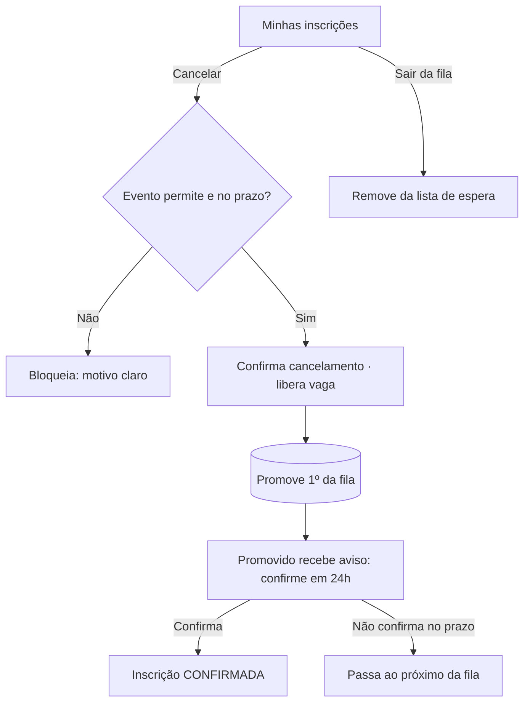

# DESIGN-004 — Cancelamento e promoção da lista de espera (da SPEC-004)

> Conduzido por Isabela (UX), com Pablo (UI) e Ada (Acessibilidade).
> **Base:** herda `DESIGN-000`. **SPEC:** SPEC-004 · **Escopo enxuto** (complementa DESIGN-001).
> **Escopo:** cancelar inscrição respeitando a política, sair da lista de espera e a experiência de **ser promovido** (aviso + prazo de 24h).

## Fluxos

## Estados — por view

| View | Carregando | Vazio | Erro | Sucesso | Parcial |
|---|---|---|---|---|---|
| **Cancelar inscrição** (confirmação) | — | — | Fora da política (não permite / prazo expirou) → bloqueio com motivo e, se aplicável, regra de reembolso | "Inscrição cancelada" + info de reembolso se houver | Cancelando (botão loading) |
| **Sair da lista de espera** | — | — | Falha → tentar de novo | "Você saiu da lista de espera" | Saindo |
| **Oferta de promoção** (promovido) | Skeleton do aviso | — | Oferta expirada → "o prazo para confirmar terminou" | "Abriu uma vaga! Confirme sua inscrição até {prazo}" + **contador de 24h** | Confirmando |

## Acessibilidade específica

- **Confirmação de cancelamento** é um diálogo com foco preso; ação destrutiva usa Button "perigo" com rótulo textual claro.
- **Contador de 24h** da promoção anunciado em marcos por `aria-live` (não rouba foco).
- Motivo de bloqueio (política/prazo) lido por leitor de tela.

## Componentes novos (além do DESIGN-000)

| Componente | Justificativa |
|---|---|
| **DiálogoConfirmaçãoCancelamento** | Confirmação de ação destrutiva com motivo/política |
| **AvisoPromoção** | Oferta de vaga com prazo e contador (canal in-app; entrega externa é SPEC-007) |

## Critérios de aceite visuais

| ID | Critério verificável | Como verificar |
|---|---|---|
| V-01 | Cancelar dentro da política confirma e libera a vaga | Cancelar inscrição elegível |
| V-02 | Cancelamento fora da política é bloqueado com motivo claro | Cancelar evento que não permite / fora do prazo |
| V-03 | Promovido vê aviso com prazo de 24h e contador | Simular abertura de vaga |
| V-04 | Oferta de promoção expirada é comunicada e a vez passa ao próximo | Deixar o prazo terminar |
| V-05 | Sair da lista de espera confirma a saída sem afetar a ordem dos demais | Sair da fila |

## Premissas

- **P-01:** política de cancelamento é **configurável por evento** (SPEC-002/EVT-04); a UI mostra a regra do evento.
- **P-02:** prazo de confirmação da promoção = **24h** (SPEC-001/P-01, a confirmar).
- **P-03:** o **aviso** in-app é o escopo aqui; a **entrega por canal externo** (e-mail/push) é SPEC-007/DESIGN de notificações (não há tela dedicada).

## Próximo passo

- Anexar V-01..V-05 à SPEC-004 (Caio). Verificar com `/kairos-forge:desenhar verificar DESIGN-004`.
