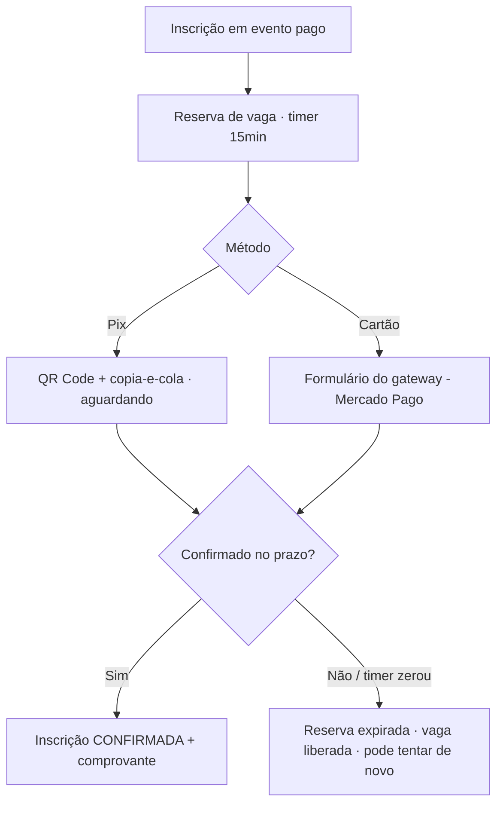

# DESIGN-005 — Pagamento (da SPEC-005)

> Conduzido por Isabela (UX), com Pablo (UI), Ada (Acessibilidade) e Helena (segurança da UI).
> **Base:** herda `DESIGN-000`. **SPEC:** SPEC-005 · **ADR:** ADR-0003 (Mercado Pago, Pix + cartão) · **Ameaças:** `docs/seguranca/AMEACAS-pagamento-2026-07-29.md`.
> **Escopo:** fluxo de pagamento do participante (Pix/cartão), reserva de vaga com contagem regressiva, e painel de acompanhamento do financeiro.

## Fluxos

## Estados — por view

| View | Carregando | Vazio | Erro | Sucesso | Parcial |
|---|---|---|---|---|---|
| **Escolha de método** | Skeleton do resumo (valor, evento) | — | Falha ao iniciar → mensagem + "tentar de novo" | Resumo + Pix/cartão + **timer de reserva (15min)** visível | Iniciando reserva |
| **Pix** | Skeleton do QR | — | Falha ao gerar cobrança → mensagem | QR + copia-e-cola + "aguardando pagamento"; **atualiza status sozinho** | Aguardando confirmação (`aria-live` no status) |
| **Cartão** | — (embed do gateway) | — | Recusado/erro do gateway → mensagem do provedor + tentar de novo | "Pagamento aprovado" → confirmação | Processando |
| **Reserva expirada** | — | — | — | Aviso "sua reserva expirou, a vaga foi liberada" `[texto: Celina]` + reabrir inscrição | Timer chegando a zero (aviso aos 2min) |
| **Painel financeiro** | Skeleton da tabela | Sem pagamentos → estado vazio | Falha ao carregar | Lista por inscrição: status (pendente/confirmado/expirado), valor, método | Filtro/paginação |

## Regras de segurança da UI (do threat model)

- **Nunca** exibir/armazenar dados de cartão na nossa UI — o cartão é digitado **no embed do Mercado Pago** (o app nunca vê o PAN).
- **Valor sempre vindo do servidor** — a tela mostra o valor do evento; o cliente **não** informa preço (AMEACAS-pagamento/AP-05).
- Status de pagamento só muda por confirmação do backend (webhook validado) — a UI **não** confirma sozinha ao "achar" que pagou (AP-01).
- Comprovante de pagamento não expõe dado sensível (só evento, valor, status, data).

## Responsivo (o que difere)

- **Mobile:** Pix com QR grande + botão "copiar código" proeminente; timer fixo no topo; ações no rodapé.
- Painel financeiro no mobile vira lista de cards (status + valor + método).

## Acessibilidade específica

- **Timer de reserva** anunciado em marcos (10min, 5min, 2min restantes) via `aria-live`, sem tocar o foco.
- Status "aguardando → confirmado" anunciado por `aria-live`.
- Botão "copiar código Pix" com confirmação acessível ("código copiado").

## Componentes novos (além do DESIGN-000)

| Componente | Justificativa |
|---|---|
| **TimerReserva** | Contagem regressiva de 15min com avisos acessíveis |
| **PainelPix** | QR + copia-e-cola + status ao vivo |
| **EmbedGatewayCartão** | Contêiner do checkout do Mercado Pago (isola o PCI do nosso app) |
| **TabelaPagamentos** | Acompanhamento do financeiro (reusa DataTable) |

## Critérios de aceite visuais

| ID | Critério verificável | Como verificar |
|---|---|---|
| V-01 | Tela mostra o valor vindo do servidor; usuário não consegue editar preço | Inspecionar payload da inscrição |
| V-02 | Reserva mostra timer de 15min e avisa ao aproximar do fim | Iniciar pagamento e observar o timer |
| V-03 | Pix exibe QR + copia-e-cola e atualiza status sem recarregar | Pagar via Pix (sandbox) |
| V-04 | Reserva expirada informa liberação da vaga e permite recomeçar | Deixar o timer zerar |
| V-05 | Dados de cartão só no embed do gateway — nunca em campos nossos | Inspecionar o DOM/rede |
| V-06 | Financeiro vê status corretos (pendente/confirmado/expirado) por inscrição | Abrir o painel financeiro |
| V-07 | Comprovante de pagamento não expõe dado sensível | Conferir o conteúdo do comprovante |

## Premissas

- **P-01:** só Pix e cartão (boleto fora — ADR-0003).
- **P-02:** timeout de reserva = 15min (SPEC-005/P-02).
- **P-03:** microcopy de erro do gateway pode vir do provedor; texto próprio marcado `[texto: Celina]`.

## Próximo passo

- Anexar V-01..V-07 à SPEC-005 (Caio).
- **Antes de implementar:** o threat model já foi feito; implementação no Épico E5, verificar com `/kairos-forge:desenhar verificar DESIGN-005`.
