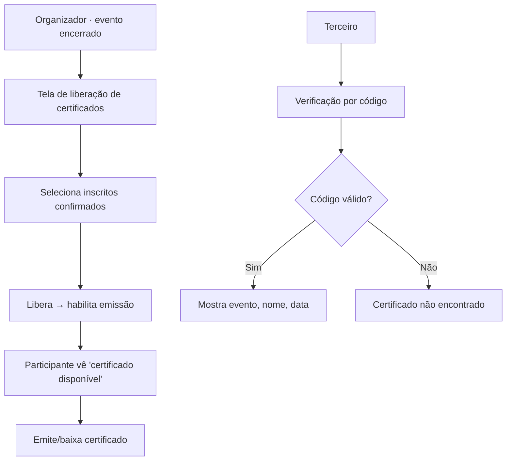

# DESIGN-006 — Emissão de certificado (da SPEC-006)

> Conduzido por Isabela (UX), com Pablo (UI) e Ada (Acessibilidade).
> **Base:** herda `DESIGN-000`. **SPEC:** SPEC-006 · **Decisão:** organizador libera manualmente (não automático).
> **Escopo:** tela de liberação (organizador), emissão/download (participante) e verificação de autenticidade (terceiro).

## Fluxos

## Estados — por view

| View | Carregando | Vazio | Erro | Sucesso | Parcial |
|---|---|---|---|---|---|
| **Liberação** (organizador) | Skeleton da lista de inscritos | Evento sem inscritos confirmados → estado vazio | Tentar liberar antes do término → bloqueio com motivo | Certificados liberados para os selecionados; confirmação | Liberando (botão loading) |
| **Emissão** (participante) | Skeleton do cartão | Sem certificados disponíveis → "Nenhum certificado disponível ainda" `[texto: Celina]` | Falha ao gerar → tentar de novo; sem liberação → "aguarde a liberação do organizador" | Certificado com nome, evento, data, carga horária + "baixar" (PDF) | Gerando o documento |
| **Verificação** (terceiro) | — | Campo de código vazio | Código inválido → "certificado não encontrado" | Dados do certificado + selo de válido | Verificando |

## Acessibilidade específica

- Liberação: seleção múltipla acessível (selecionar todos / por participante) com estado anunciado.
- O certificado gerado (PDF) tem texto real (não imagem) para leitura por leitor de tela.
- Verificação: resultado (válido/inválido) anunciado por `aria-live`.

## Componentes novos (além do DESIGN-000)

| Componente | Justificativa |
|---|---|
| **ListaLiberação** | Seleção de inscritos confirmados para liberar |
| **CartãoCertificado** | Pré-visualização + ação de baixar |
| **VerificadorCódigo** | Consulta pública de autenticidade |

## Critérios de aceite visuais

| ID | Critério verificável | Como verificar |
|---|---|---|
| V-01 | Liberação só habilita emissão para inscritos confirmados e após o término | Tentar liberar antes do fim / a não-confirmado |
| V-02 | Participante sem liberação vê aviso e não consegue emitir | Abrir com certificado não liberado |
| V-03 | Certificado emitido contém nome, evento, data e carga horária corretos | Emitir e conferir o conteúdo |
| V-04 | Certificado é texto acessível (não imagem) | Ler com leitor de tela / selecionar texto |
| V-05 | Verificação por código mostra válido/inválido corretamente | Consultar código real e inválido |

## Premissas

- **P-01:** liberação **manual** pelo organizador (decisão da sessão) — sem check-in de presença nesta versão.
- **P-02:** formato do certificado (PDF, carga horária calculada das atividades) segue SPEC-006/Q-01.
- **P-03:** envio do certificado por e-mail é SPEC-007 (fora); aqui é emissão/download.

## Próximo passo

- Anexar V-01..V-05 à SPEC-006 (Caio). Verificar com `/kairos-forge:desenhar verificar DESIGN-006`.
