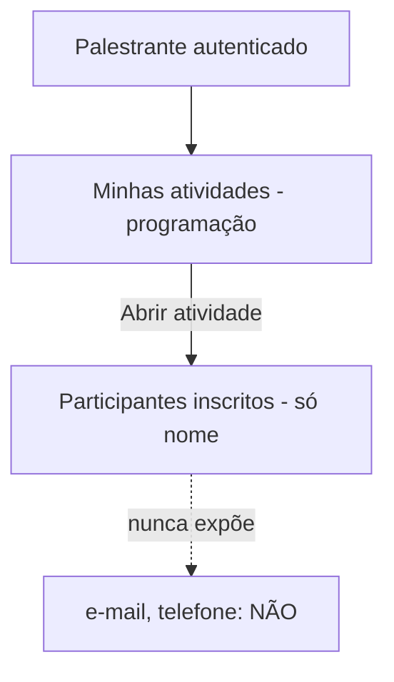

# DESIGN-008 — Painel do palestrante (da SPEC-008)

> Conduzido por Isabela (UX), com Pablo (UI), Ada (Acessibilidade) e Helena (privacidade/PII).
> **Base:** herda `DESIGN-000`. **SPEC:** SPEC-008 · **Decisão:** palestrante vê só **nome + atividade** (minimização LGPD).
> **Escopo:** painel **somente leitura** — atividades do palestrante e participantes inscritos nelas.

## Fluxos

## Estados — por view

| View | Carregando | Vazio | Erro | Sucesso | Parcial |
|---|---|---|---|---|---|
| **Minhas atividades** | Skeleton de lista | Nenhuma atividade atribuída → "Você ainda não tem atividades" `[texto: Celina]` | Falha ao carregar → tentar de novo | Lista das atividades do palestrante com horários | — |
| **Participantes da atividade** | Skeleton de lista | Atividade sem inscritos → "Nenhum inscrito ainda" | Falha ao carregar; acesso indevido → 403 amigável | Lista com **apenas nome** dos participantes confirmados | Paginação |

## Regras de privacidade da UI (do threat model / LGPD)

- A tela mostra **somente nome** + a atividade. **Nunca** e-mail, telefone ou outros dados (SPEC-008/I1).
- A minimização é garantida no **backend** (projeção mínima) — a UI não "esconde" campos que vieram; eles não vêm (AMEACAS-auth/AP-09).
- Painel é **somente leitura** — sem ações de edição.

## Acessibilidade específica

- Lista de participantes com contagem anunciada (`aria-live`) e cabeçalho claro ("Participantes de {atividade}").
- 403 (atividade de terceiro) devolve foco ao topo com link para "minhas atividades".

## Componentes novos (além do DESIGN-000)

| Componente | Justificativa |
|---|---|
| **ListaAtividadesPalestrante** | Programação do palestrante (reusa DataList) |
| **ListaParticipantesMínima** | Só nome — projeção mínima explícita |

## Critérios de aceite visuais

| ID | Critério verificável | Como verificar |
|---|---|---|
| V-01 | Palestrante vê suas atividades com horários | Abrir o painel |
| V-02 | Lista de participantes mostra **apenas nome** (sem e-mail/telefone no payload) | Inspecionar a resposta da API |
| V-03 | Acesso a atividade de outro palestrante é negado (403) | Forçar id de atividade alheia |
| V-04 | Painel é somente leitura (nenhuma ação de edição) | Percorrer a tela |

## Premissas

- **P-01:** exibe participantes **confirmados** (SPEC-008/Q-01, a confirmar — lista de espera fora por ora).
- **P-02:** depende de auth/papéis (SPEC-009) para identificar o palestrante e isolar suas atividades.

## Próximo passo

- Anexar V-01..V-04 à SPEC-008 (Caio). Verificar com `/kairos-forge:desenhar verificar DESIGN-008`.
