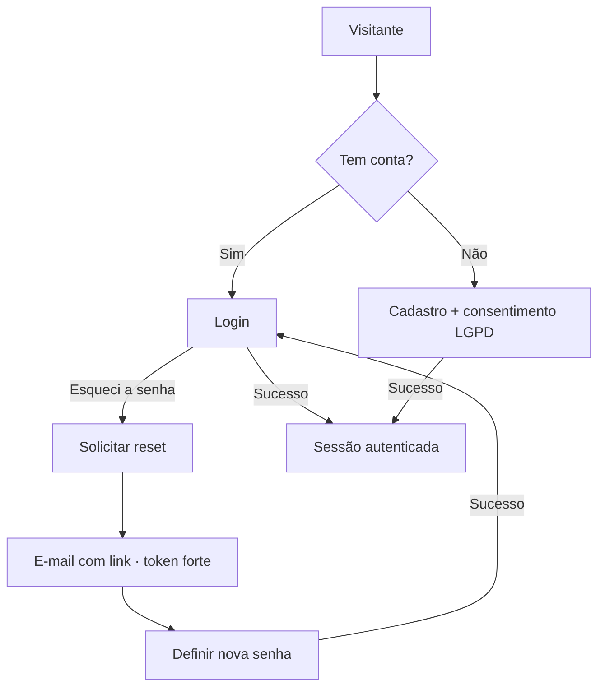

# DESIGN-009 — Autenticação (da SPEC-009)

> Conduzido por Isabela (UX), com Pablo (UI), Ada (Acessibilidade) e Helena (segurança da UI).
> **Base:** herda `DESIGN-000`. **SPEC:** SPEC-009 · **ADR:** ADR-0002 (auth Rails nativo, cookie httpOnly + BFF).
> **Escopo enxuto:** login, cadastro (com consentimento) e recuperação de senha. Padrões conhecidos — o valor aqui é a **segurança da UI** e a acessibilidade dos formulários.

## Fluxos

## Estados — por view

| View | Carregando | Vazio | Erro | Sucesso | Parcial |
|---|---|---|---|---|---|
| **Login** | — | Formulário limpo | Credencial inválida → mensagem **genérica** ("e-mail ou senha inválidos"); após N tentativas → aviso de bloqueio temporário | Sessão criada → redireciona | Botão "Entrar" em loading |
| **Cadastro** | — | Formulário limpo | Erro por campo (associado); e-mail já usado → mensagem **genérica** para não enumerar | Conta criada + consentimento registrado | Enviando |
| **Solicitar reset** | — | Campo de e-mail | — | Mensagem **sempre genérica** ("se existir conta, enviamos o link") — nunca revela se o e-mail existe | Enviando |
| **Definir nova senha** | Skeleton (validando token) | — | Token inválido/expirado → mensagem + reenviar solicitação | Senha alterada + sessões antigas invalidadas → login | Salvando |

## Regras de segurança da UI (do threat model)

- **Mensagens genéricas** em login e reset — nunca revelar se o e-mail existe (AMEACAS-auth/AP-07).
- **Política de senha** exibida no cadastro (mínimo, força) antes de submeter (AUTH-06).
- **Rate limit/lockout** comunicado com clareza sem detalhar o mecanismo (AP-03).
- Nenhum dado sensível na URL; token de reset nunca exibido em tela.

## Acessibilidade específica

- Campos de senha com opção "mostrar/ocultar" acessível; `autocomplete` correto (`current-password`, `new-password`).
- Erro de submit move o foco para o resumo de erro no topo.
- Medidor de força de senha anunciado por `aria-live` (não só cor).

## Componentes novos (além do DESIGN-000)

| Componente | Justificativa |
|---|---|
| **CampoSenha** | Input de senha com mostrar/ocultar + `autocomplete` |
| **MedidorForçaSenha** | Feedback de força acessível (texto + cor) |
| **CaixaConsentimento** | Consentimento LGPD explícito no cadastro |

## Critérios de aceite visuais

| ID | Critério verificável | Como verificar |
|---|---|---|
| V-01 | Login inválido mostra mensagem genérica (não revela qual campo) | Errar e-mail e senha separadamente |
| V-02 | Solicitar reset responde igual para e-mail existente e inexistente | Testar ambos |
| V-03 | Cadastro exige e registra consentimento LGPD | Cadastrar sem marcar consentimento (bloqueia) |
| V-04 | Política de senha visível e senha fraca é rejeitada com feedback | Digitar senha fraca |
| V-05 | Token de reset inválido/expirado mostra erro e caminho de reenvio | Usar link expirado |
| V-06 | Campos de senha têm mostrar/ocultar e `autocomplete` corretos | Inspecionar os inputs |

## Premissas

- **P-01:** sem login social/SSO nesta versão (ADR-0002); só credencial própria.
- **P-02:** MFA fora da primeira versão (SPEC-009/Q-02) — a UI reserva espaço para adicioná-lo depois.

## Próximo passo

- Anexar V-01..V-06 à SPEC-009 (Caio). Verificar com `/kairos-forge:desenhar verificar DESIGN-009`.
