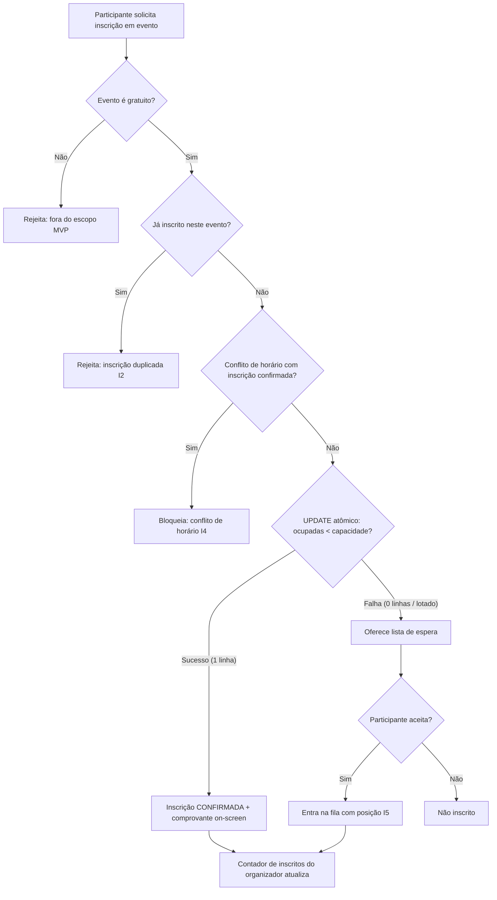

# SPEC-001 — Inscrição em evento com controle de vagas e lista de espera

> Autores: **Diego (Sistemas)** coordena · **Fernanda (Dados)** modela · Laura (Tech Lead) classificou.
> Tamanho: **Grande** · Apetite: **ciclo curto de MVP** (só eventos gratuitos).

## Contexto e problema

A Eventus gerencia inscrições hoje em formulários e planilhas, sem controle automático de vagas. Quando um evento lota, não há mecanismo de lista de espera, e o organizador não enxerga a lotação em tempo real. Participantes também querem se inscrever em vários workshops no mesmo dia — mas workshops no mesmo horário são simultâneos, então não faz sentido inscrever-se em dois ao mesmo tempo.

Esta SPEC define o **núcleo do sistema**: a inscrição de um participante em um evento **gratuito**, com controle automático de vagas (sem *overbooking*, mesmo sob inscrições concorrentes), entrada em lista de espera quando lotado, bloqueio de conflito de horário e contagem de inscritos em tempo real para o organizador.

Fonte de requisitos: `elicitacao.txt` e `contextos/restricoes.md`.

## Objetivo

Permitir que um participante se inscreva em um evento gratuito com controle automático e correto de vagas, entrando em lista de espera quando o evento estiver lotado.

## Não-objetivos

- **Pagamento, confirmação de pagamento e reembolso** — eventos pagos ficam para SPEC própria. Aqui, todo evento é tratado como gratuito (vaga confirma na inscrição).
- **Cancelamento de inscrição** — SPEC própria. Como a promoção da lista de espera depende de uma vaga ser liberada (cancelamento), a **promoção em si fica fora** desta SPEC. Aqui cobrimos apenas *entrar* na fila e ver a posição.
- **Catálogo/listagem de todos os eventos** — assume-se que o evento é alcançável por identificador. A vitrine de eventos é SPEC separada.
- **Emissão de certificado** — SPEC própria.
- **Entrega de comprovante por canal externo** (e-mail, push) — o canal de notificação é questão em aberto (#5). Aqui cobrimos apenas a **confirmação exibida na tela** após a inscrição.
- **Autenticação/cadastro do participante** — assume-se um participante identificado; auth é pré-requisito a ser especificado à parte.

## Invariantes

- **I1 — Sem overbooking:** o número de inscrições confirmadas de um evento **nunca** excede sua capacidade, mesmo sob inscrições simultâneas.
- **I2 — Inscrição única:** um participante tem no máximo **uma** inscrição ativa (confirmada ou em lista de espera) por evento.
- **I3 — Só gratuito nesta versão:** só é possível inscrever-se em evento marcado como gratuito.
- **I4 — Sem sobreposição de horário:** um participante não tem duas inscrições confirmadas em atividades cujos horários se sobrepõem.
- **I5 — Fila determinística:** a posição na lista de espera é única e sequencial por evento (ordem de chegada).

## Diagrama

## Requisitos rastreáveis

| ID | Requisito | Prioridade | Critério de aceite | Status | Verificação |
|---|---|---|---|---|---|
| INSCR-01 | Como participante, quero me inscrever em um evento gratuito com vaga disponível, para garantir minha participação. | P1 | WHEN um participante solicita inscrição em evento gratuito com `ocupadas < capacidade` THEN o sistema SHALL registrar inscrição CONFIRMADA e incrementar `ocupadas` em 1. | Pendente | — |
| INSCR-02 | Como organizador, quero que o sistema nunca exceda a capacidade, para não vender mais vagas do que existem. | P1 | WHEN N inscrições concorrentes disputam as últimas M vagas (N>M) THEN o sistema SHALL confirmar exatamente M e nunca deixar `ocupadas > capacidade` (invariante I1). | Pendente | — |
| INSCR-03 | Como participante, quero entrar na lista de espera quando o evento estiver lotado, para ser considerado se abrir vaga. | P1 | WHEN um participante solicita inscrição em evento com `ocupadas = capacidade` e aceita a lista de espera THEN o sistema SHALL registrar entrada com posição sequencial única (I5). | Pendente | — |
| INSCR-04 | Como participante, quero ser impedido de me inscrever em atividade que conflita no horário com outra já confirmada, para não me comprometer com duas ao mesmo tempo. | P1 | WHEN um participante com inscrição confirmada em atividade de horário [h1,h2) solicita inscrição em atividade que se sobrepõe a [h1,h2) THEN o sistema SHALL bloquear a inscrição e informar o conflito (I4). | Pendente | — |
| INSCR-05 | Como participante, quero me inscrever em vários workshops no mesmo dia desde que não conflitem no horário, para aproveitar o evento. | P2 | WHEN um participante se inscreve em duas atividades no mesmo dia com horários não sobrepostos THEN o sistema SHALL confirmar ambas. | Pendente | — |
| INSCR-06 | Como organizador, quero acompanhar a quantidade de inscritos em tempo real, para gerir o evento. | P1 | WHEN uma inscrição é confirmada ou entra na lista de espera THEN a contagem exibida ao organizador SHALL refletir o novo total sem recarregar manualmente (latência-alvo a definir). | Pendente | — |
| INSCR-07 | Como participante, quero ver uma confirmação/comprovante logo após me inscrever, para ter certeza de que deu certo. | P1 | WHEN uma inscrição é confirmada THEN o sistema SHALL exibir na tela um comprovante com evento, participante, status e data/hora. | Pendente | — |
| INSCR-08 | Como participante, quero ver quantas vagas restam em um evento, para decidir se me inscrevo. | P2 | WHEN um participante visualiza um evento THEN o sistema SHALL exibir `capacidade - ocupadas` (ou "lotado"). | Pendente | — |
| INSCR-09 | Como organizador, quero impedir inscrição duplicada do mesmo participante no mesmo evento, para manter a integridade das vagas. | P1 | WHEN um participante já inscrito (confirmado ou em espera) solicita nova inscrição no mesmo evento THEN o sistema SHALL rejeitar (I2). | Pendente | — |

## Plano de implementação

> ⚠️ **Bloqueio T0:** a stack e o banco ainda são `<a preencher>` (`contextos/stack.md`). Nenhuma tarefa de implementação roda antes do T0. Os gates estão como `<a definir>` até `contextos/testes.md` ser preenchido.

| Tarefa | Agente | Requisito(s) | Arquivos/áreas | Depende de | Done when | Gate |
|---|---|---|---|---|---|---|
| T0 | [Rafael] + [Elisa] | — | `docs/adr/` | - | ADR de stack + banco registrado; ADR ratificando a estratégia de concorrência (UPDATE condicional atômico). | ADR revisado |
| T1 | [Fernanda] → [Carlos] | INSCR-01..09 | `migrations/` (schema: evento, inscricao, lista_espera) | T0 | Schema com `capacidade`, `ocupadas`, unicidade (participante,evento), flag gratuito; migration aplica e faz rollback. | `<a definir>` |
| T2 | [Thiago] → [Lucas] | INSCR-01, INSCR-02, INSCR-09 | serviço/endpoint de inscrição | T1 | Inscrição confirma via UPDATE condicional atômico; teste de concorrência prova I1; duplicidade rejeitada. | `<a definir>` |
| T3 | [Lucas] | INSCR-04, INSCR-05 | regra de conflito de horário | T1 | Sobreposição bloqueia; não-sobreposição no mesmo dia confirma. | `<a definir>` |
| T4 | [Lucas] | INSCR-03 | lista de espera | T2 | Evento lotado oferece fila; posição sequencial única atribuída. | `<a definir>` |
| T5 | [Renata] + [Lucas] | INSCR-06 | contagem em tempo real + instrumentação | T2 | Contador do organizador atualiza a cada inscrição/entrada na fila. | `<a definir>` |
| T6 | [Isabela] → [Marina] + [Pablo] + [Ada] | INSCR-07, INSCR-08 | tela de inscrição + confirmação (5 estados) | T2 | Fluxo de inscrição com estados vazio/carregando/erro/sucesso/lotado; comprovante on-screen; acessível. | `<a definir>` |
| T7 | [Ricardo] | INSCR-01..09 | testes | T2–T6 | Caminho feliz + erros cobertos; teste de concorrência para I1. | `<a definir>` |

## Matriz de testes

| Requisito | Tipo | Responsável | Comando/gate | Evidência esperada |
|---|---|---|---|---|
| INSCR-01 | integration | [Ricardo] | `<a definir>` | Inscrição em evento com vaga → CONFIRMADA, `ocupadas` +1. |
| INSCR-02 | integration (concorrência) | [Ricardo] | `<a definir>` | N inscrições paralelas nas últimas M vagas → exatamente M confirmadas, 0 overbooking. |
| INSCR-03 | integration | [Ricardo] | `<a definir>` | Evento lotado → entrada na fila com posição correta. |
| INSCR-04 | unit + integration | [Ricardo] | `<a definir>` | Horário sobreposto → bloqueio; mensagem de conflito. |
| INSCR-05 | integration | [Ricardo] | `<a definir>` | Duas atividades no mesmo dia sem sobreposição → ambas confirmadas. |
| INSCR-06 | integration/e2e | [Ricardo] | `<a definir>` | Contador do organizador reflete nova inscrição. |
| INSCR-07 | e2e/manual | [Ricardo] | `<a definir>` | Tela mostra comprovante após inscrição. |
| INSCR-08 | integration | [Ricardo] | `<a definir>` | Vagas restantes exibidas; "lotado" quando cheio. |
| INSCR-09 | integration | [Ricardo] | `<a definir>` | Segunda inscrição do mesmo participante → rejeitada. |

## Riscos e mitigações

| Risco | Mitigação |
|---|---|
| **Overbooking sob concorrência** (o risco central) | UPDATE condicional atômico (I1) + teste de concorrência obrigatório em INSCR-02. Ratificar approach em ADR no T0. |
| Stack indefinida trava implementação | T0 explícito como pré-requisito; gates `<a definir>` até `contextos/testes.md` existir. |
| Lista de espera sem promoção pode frustrar usuário | Escopo honesto: esta SPEC só *coloca* na fila; promoção acoplada à SPEC de cancelamento. Documentar isso na UI (T6). |
| Conflito de horário depende de dados de horário confiáveis das atividades | Modelar `inicio`/`fim` por atividade no schema (T1); fuso horário a definir na modelagem. |
| Canal de comprovante indefinido (#5) | Cobrir só confirmação on-screen; entrega externa em SPEC de notificações. |

## Premissas

- **P-01 (ADR-0019, reversível):** prazo de confirmação da lista de espera = **24h**. A definir pelo negócio; adotado como default para não bloquear. Só se materializa quando a promoção for implementada (fora desta SPEC).
- **P-02:** estratégia de concorrência = UPDATE condicional atômico (abordagem A). A ratificar em ADR no T0.
- **P-03:** todo evento é gratuito nesta versão (I3).

## Perguntas abertas

- **Q-01:** latência-alvo do "tempo real" do contador do organizador (polling? push? intervalo aceitável?) — decidir com a stack.
- **Q-02:** fuso horário de referência para conflito de horário (evento local vs. participante).
- **Q-03:** o prazo de 24h da lista de espera (P-01) está bom? Confirmar com o negócio.
- **Q-04:** capacidade pode ser alterada pelo organizador depois de aberta a inscrição? (afeta lista de espera e overbooking) — provável follow-up.

## Validação

Antes de `/kairos-forge:revisar`, rode:

`/kairos-forge:validar SPEC-001`

## Próximo passo

Feature tem UI (T6) → antes de mobilizar, rode: `/kairos-forge:desenhar SPEC-001`

Depois: `/kairos-forge:mobilizar SPEC-001` (ou execução sequencial `/kairos-forge:rodar`).

> Pré-requisito real: resolver **T0** (escolher stack + banco, registrar ADR) — nenhuma tarefa de código roda antes disso.
