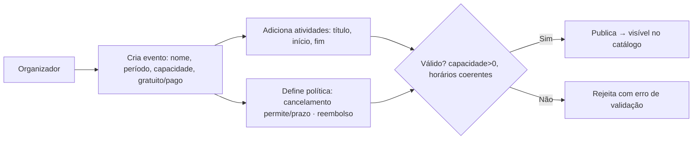

# SPEC-002 — Gestão de eventos pelo organizador

> Autores: **Fernanda (Dados)** modela · **Diego (Sistemas)** coordena · Laura classificou.
> Tamanho: **Grande** · Fundacional — pré-requisito da SPEC-001.

## Contexto e problema

Nada na SPEC-001 (inscrição) funciona sem eventos cadastrados. O organizador precisa criar eventos com capacidade, marcá-los como gratuitos ou pagos, e cadastrar **atividades com horário de início e fim** — dado essencial para o bloqueio de conflito de horário (INSCR-04). Aqui também ficam as **políticas configuráveis por evento** (cancelamento e reembolso) que serão *enforced* nas SPEC-004 e SPEC-005.

## Objetivo

Permitir que o organizador crie e gerencie eventos, suas atividades (com horários) e suas políticas de cancelamento/reembolso.

## Não-objetivos

- Inscrição de participantes (SPEC-001), catálogo público (SPEC-003).
- Fluxo de pagamento (SPEC-005) — aqui só se **marca** o evento como pago e se define a política; a cobrança é outra SPEC.
- Autenticação/atribuição de papéis (organizador vs. participante) — pré-requisito a especificar à parte (ver Perguntas abertas).

## Invariantes

- **I1:** `capacidade > 0`.
- **I2:** toda atividade tem `inicio < fim` e cabe dentro do período do evento.
- **I3:** evento pago tem política de reembolso definida antes de publicar; evento gratuito ignora reembolso.
- **I4:** evento só fica visível no catálogo quando **publicado**.

## Diagrama

## Requisitos rastreáveis

| ID | Requisito | Prioridade | Critério de aceite | Status | Verificação |
|---|---|---|---|---|---|
| EVT-01 | Como organizador, quero criar um evento com nome, descrição, período e capacidade, para abrir inscrições. | P1 | WHEN o organizador envia evento válido (capacidade>0, período coerente) THEN o sistema SHALL persistir o evento em rascunho. | Pendente | — |
| EVT-02 | Como organizador, quero marcar o evento como gratuito ou pago, para definir se exige pagamento. | P1 | WHEN o organizador define o tipo THEN o sistema SHALL registrar `gratuito` ou `pago`; pago exige política de reembolso (I3). | Pendente | — |
| EVT-03 | Como organizador, quero cadastrar atividades com início e fim, para montar a programação e permitir detecção de conflito. | P1 | WHEN o organizador adiciona atividade com `inicio<fim` dentro do período do evento THEN o sistema SHALL persisti-la (I2). | Pendente | — |
| EVT-04 | Como organizador, quero definir a política de cancelamento (permite? até quando?), para controlar desistências. | P1 | WHEN o organizador define a política THEN o sistema SHALL registrar `permite_cancelamento` e `prazo_limite` (default: 24h antes do início — P-01). | Pendente | — |
| EVT-05 | Como organizador, quero definir a política de reembolso do evento pago, para deixar claro o direito do participante. | P2 | WHEN o evento é pago THEN o sistema SHALL exigir `reembolsavel` e, se sim, a regra de prazo antes de publicar (I3). | Pendente | — |
| EVT-06 | Como organizador, quero publicar/despublicar um evento, para controlar sua visibilidade. | P2 | WHEN o organizador publica um evento válido THEN ele SHALL ficar visível no catálogo (I4); despublicar remove da vitrine. | Pendente | — |
| EVT-07 | Como organizador, quero ver a lista dos meus eventos com status, para gerenciá-los. | P2 | WHEN o organizador acessa seus eventos THEN o sistema SHALL listar cada um com status (rascunho/publicado) e lotação. | Pendente | — |
| EVT-08 | Como organizador, quero que capacidade e horários inválidos sejam rejeitados, para não abrir eventos inconsistentes. | P1 | WHEN capacidade ≤ 0 ou `fim ≤ inicio` ou atividade fora do período THEN o sistema SHALL rejeitar com mensagem clara. | Pendente | — |

## Plano de implementação

> Bloqueio: T0 (stack + banco) da SPEC-001 precede toda implementação. Gates `<a definir>` até `contextos/testes.md`.

| Tarefa | Agente | Requisito(s) | Arquivos/áreas | Depende de | Done when | Gate |
|---|---|---|---|---|---|---|
| T1 | [Fernanda] → [Carlos] | EVT-01..08 | `migrations/` (evento, atividade, política) | SPEC-001/T0 | Schema de evento + atividade + campos de política; migration aplica/rollback. | `<a definir>` |
| T2 | [Thiago] → [Lucas] | EVT-01..03, EVT-08 | endpoints CRUD de evento/atividade | T1 | Criar/editar evento e atividade com validação (I1,I2). | `<a definir>` |
| T3 | [Lucas] | EVT-04, EVT-05 | política de cancelamento/reembolso | T1 | Campos de política persistidos e validados (I3). | `<a definir>` |
| T4 | [Lucas] | EVT-06 | publicar/despublicar | T2 | Transição de status controla visibilidade (I4). | `<a definir>` |
| T5 | [Isabela] → [Marina] + [Pablo] + [Ada] | EVT-01..07 | UI do organizador (5 estados) | T2 | Formulário de evento/atividade acessível, com estados de erro. | `<a definir>` |
| T6 | [Ricardo] | EVT-01..08 | testes | T2–T5 | Caminho feliz + validações de erro cobertas. | `<a definir>` |

## Matriz de testes

| Requisito | Tipo | Responsável | Comando/gate | Evidência esperada |
|---|---|---|---|---|
| EVT-01/02 | integration | [Ricardo] | `<a definir>` | Evento criado e tipo registrado. |
| EVT-03 | integration | [Ricardo] | `<a definir>` | Atividade com horários coerentes persistida. |
| EVT-04/05 | integration | [Ricardo] | `<a definir>` | Políticas persistidas; pago sem reembolso não publica. |
| EVT-06 | e2e | [Ricardo] | `<a definir>` | Publicar torna visível; despublicar oculta. |
| EVT-08 | unit + integration | [Ricardo] | `<a definir>` | Capacidade/horário inválidos rejeitados. |

## Riscos e mitigações

| Risco | Mitigação |
|---|---|
| Falta de auth/papéis para distinguir organizador | Registrar como pré-requisito (Perguntas abertas); UI assume organizador identificado. |
| Alterar capacidade após inscrições abertas (Q-04 da SPEC-001) | Tratar em follow-up; por ora, capacidade editável só em rascunho. |
| Horário de atividade sem fuso definido | Definir fuso na modelagem (T1), alinhado à Q-02 da SPEC-001. |

## Premissas

- **P-01:** `prazo_limite` de cancelamento default = 24h antes do início (reversível; confirmar).

## Perguntas abertas

- **Q-01:** Autenticação e atribuição de papéis (organizador, participante, financeiro, palestrante) — **pré-requisito não elicitado (#9)**. Precisa de SPEC própria antes da implementação.
- **Q-02:** Capacidade pode mudar após publicar? (herda Q-04 da SPEC-001.)

## Design

Handoff visual concluído: `docs/design/DESIGN-002-gestao-de-eventos.md` (Isabela/Pablo/Ada). Define os 5 estados por view, responsivo, acessibilidade e **10 critérios de aceite visuais (V-01..V-10)** que o `/kairos-forge:desenhar verificar` cobra. Alerta: projeto sem design system — tokens + componentes base nascem nesta feature.

## Critérios de aceite visuais (DESIGN-002)

Rastreáveis; o "como verificar" está em `docs/design/DESIGN-002-gestao-de-eventos.md`. Aplicam-se também os critérios globais **VG-01..08** do `DESIGN-000`.

| ID | Critério | Status |
|---|---|---|
| V-01 | Lista vazia mostra CTA "Criar primeiro evento" focável | Pendente |
| V-02 | `capacidade ≤ 0` bloqueia com erro ligado ao campo | Pendente |
| V-03 | Atividade `fim ≤ início` mostra erro inline; modal não fecha | Pendente |
| V-04 | Publicar evento inválido lista as pendências e não publica | Pendente |
| V-05 | Cada carregamento usa skeleton específico (não spinner) | Pendente |
| V-06 | Badge de status e contador de lotação visíveis na lista | Pendente |
| V-07 | Modal de atividade prende e devolve o foco | Pendente |
| V-08 | Contraste AA; status não comunicado só por cor | Pendente |
| V-09 | Alvos de toque ≥ 44px nas ações primárias | Pendente |
| V-10 | Fluxo criar → atividade → publicar navegável por teclado | Pendente |

## Validação

`/kairos-forge:validar SPEC-002`

## Próximo passo

✅ Design feito (DESIGN-002). Depois de aprovada: `/kairos-forge:mobilizar SPEC-002` — começar pela fundação de tokens/componentes base (Pablo) e depois as telas; ao final, `/kairos-forge:desenhar verificar DESIGN-002`.
