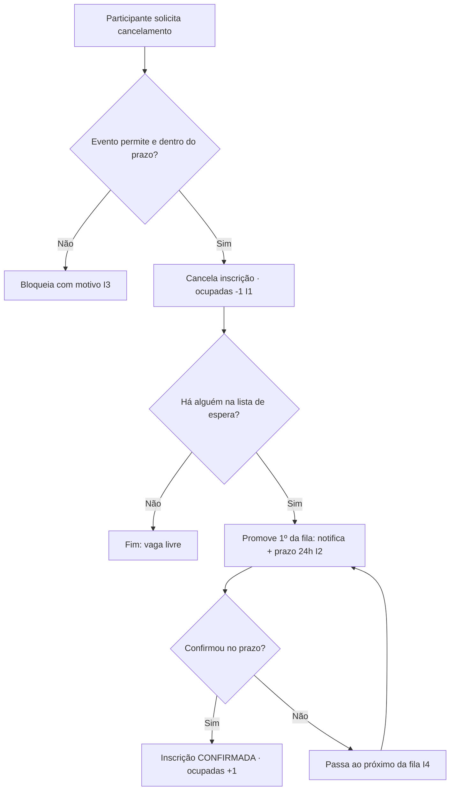

# SPEC-004 — Cancelamento de inscrição e promoção da lista de espera

> Autores: **Diego (Sistemas)** coordena · **Murilo (Eventos)** na promoção · Laura classificou.
> Tamanho: **Grande** · Fecha o laço deixado aberto na SPEC-001.

## Contexto e problema

A SPEC-001 deixou a **promoção da lista de espera** de fora porque ela depende de uma vaga ser liberada — e a vaga só é liberada por cancelamento. Esta SPEC entrega o cancelamento (respeitando a política configurável por evento da SPEC-002) e, ao liberar a vaga, **promove o primeiro da fila** conforme a política decidida: notifica e dá prazo para confirmar (24h — premissa P-01 da SPEC-001).

## Objetivo

Permitir que o participante cancele sua inscrição segundo a política do evento e que a vaga liberada promova o próximo da lista de espera de forma justa e determinística.

## Não-objetivos

- Reembolso do valor pago — tratado na SPEC-005 (aqui apenas dispara o gatilho de reembolso quando aplicável).
- Definição do canal de notificação — abstraído; entrega concreta é SPEC-007.

## Invariantes

- **I1:** `ocupadas` nunca fica negativo; cancelar decrementa em 1.
- **I2:** cada vaga liberada promove **no máximo um** participante por vez, respeitando a ordem da fila (SPEC-001/I5).
- **I3:** cancelamento só é aceito se o evento permite e dentro do `prazo_limite` (SPEC-002/EVT-04).
- **I4:** um participante promovido que não confirma no prazo perde a vez, que passa ao próximo — sem furar a ordem.

## Diagrama

## Requisitos rastreáveis

| ID | Requisito | Prioridade | Critério de aceite | Status | Verificação |
|---|---|---|---|---|---|
| CANC-01 | Como participante, quero cancelar minha inscrição sem contatar a organização, para liberar minha vaga quando não puder ir. | P1 | WHEN o participante cancela uma inscrição confirmada de evento que permite e dentro do prazo THEN o sistema SHALL marcar CANCELADA e decrementar `ocupadas` (I1). | Pendente | — |
| CANC-02 | Como organizador, quero impedir cancelamento fora da política, para respeitar as regras do evento. | P1 | WHEN o evento não permite cancelamento OU o prazo expirou THEN o sistema SHALL bloquear com motivo claro (I3). | Pendente | — |
| CANC-03 | Como participante em lista de espera, quero ser promovido quando abrir vaga, para conseguir participar. | P1 | WHEN uma vaga é liberada e há fila THEN o sistema SHALL promover o 1º da fila, notificando-o e abrindo prazo de 24h para confirmar (I2). | Pendente | — |
| CANC-04 | Como organizador, quero que a vaga passe ao próximo se o promovido não confirmar, para não desperdiçar a vaga. | P2 | WHEN o promovido não confirma dentro de 24h THEN o sistema SHALL revogar a oferta e promover o próximo da fila (I4). | Pendente | — |
| CANC-05 | Como participante em lista de espera, quero poder sair da fila, para não ser promovido se desistir. | P2 | WHEN o participante sai da lista de espera THEN o sistema SHALL removê-lo sem afetar a ordem dos demais. | Pendente | — |
| CANC-06 | Como equipe financeira, quero que o cancelamento de evento pago dispare o fluxo de reembolso quando aplicável, para tratar o valor. | P2 | WHEN um evento pago reembolsável é cancelado dentro da regra THEN o sistema SHALL sinalizar reembolso à SPEC-005. | Pendente | — |

## Plano de implementação

> Bloqueio: T0 (stack) precede implementação. Gates `<a definir>`.

| Tarefa | Agente | Requisito(s) | Arquivos/áreas | Depende de | Done when | Gate |
|---|---|---|---|---|---|---|
| T1 | [Lucas] | CANC-01, CANC-02 | serviço de cancelamento | SPEC-001, SPEC-002 | Cancela respeitando política; decremento transacional (I1). | `<a definir>` |
| T2 | [Murilo] → [Lucas] | CANC-03, CANC-04 | promoção da fila (idempotente) | T1 | Promove 1º com prazo; expira e passa ao próximo (I2,I4); sem promoção dupla. | `<a definir>` |
| T3 | [Lucas] | CANC-05 | saída da lista de espera | SPEC-001 | Remoção da fila preserva ordem. | `<a definir>` |
| T4 | [Lucas] | CANC-06 | gatilho de reembolso | SPEC-005 | Emite evento de reembolso quando aplicável. | `<a definir>` |
| T5 | [Renata] | CANC-03 | instrumentação da promoção | T2 | Log/trace de cada promoção e expiração. | `<a definir>` |
| T6 | [Ricardo] | CANC-01..06 | testes | T1–T4 | Cancelar decrementa; promoção respeita ordem; expiração passa ao próximo. | `<a definir>` |

## Matriz de testes

| Requisito | Tipo | Responsável | Comando/gate | Evidência esperada |
|---|---|---|---|---|
| CANC-01 | integration | [Ricardo] | `<a definir>` | Cancelamento válido → CANCELADA, `ocupadas` −1. |
| CANC-02 | integration | [Ricardo] | `<a definir>` | Fora da política → bloqueio com motivo. |
| CANC-03 | integration | [Ricardo] | `<a definir>` | Vaga liberada promove 1º da fila. |
| CANC-04 | integration | [Ricardo] | `<a definir>` | Sem confirmação em 24h → próximo promovido. |
| CANC-05 | integration | [Ricardo] | `<a definir>` | Saída da fila mantém ordem. |

## Riscos e mitigações

| Risco | Mitigação |
|---|---|
| Promoção concorrente (duas vagas liberadas ao mesmo tempo) promove errado | Promoção idempotente e serializada por evento (Murilo); teste de concorrência. |
| Prazo de 24h depende de notificação (canal indefinido) | Abstrair canal (SPEC-007); usar relógio do sistema para expiração independente do canal. |
| Reembolso acoplado sem SPEC-005 pronta | CANC-06 apenas emite evento; consumo fica na SPEC-005. |

## Premissas

- **P-01:** prazo de confirmação da promoção = 24h (herdado da SPEC-001; reversível).

## Perguntas abertas

- **Q-01:** Confirmar 24h com o negócio (herda Q-03 da SPEC-001).
- **Q-02:** Cancelamento parcial (só uma atividade) vs. do evento inteiro — definir granularidade.

## Validação

`/kairos-forge:validar SPEC-004`

## Próximo passo

`/kairos-forge:mobilizar SPEC-004` (após SPEC-001 e SPEC-002 implementadas).
