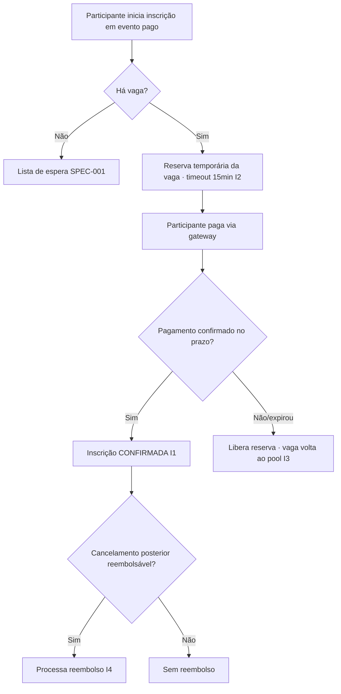

# SPEC-005 — Pagamento, confirmação e reembolso

> Autores: **Thiago (Integrações)** coordena · **Fernanda (Dados)** nas transações · **Helena (Segurança)** obrigatória · Laura classificou.
> Tamanho: **Complexo** — integração externa + dado financeiro/PII + reversibilidade baixa.

## Contexto e problema

Alguns eventos são pagos e exigem confirmação de pagamento **antes de liberar a inscrição**; outros têm direito a reembolso e outros não. A SPEC-001 tratou só eventos gratuitos. Esta SPEC introduz pagamento para eventos pagos, a confirmação pela equipe financeira e o reembolso conforme a política configurável por evento (SPEC-002).

Por ser Complexa (lida com dinheiro e dados pessoais), **é obrigatório** rodar antes da implementação:

`/kairos-forge:analisar-ameacas SPEC-005`

## Objetivo

Permitir a inscrição em eventos pagos com controle de vaga durante o pagamento, confirmação de pagamento antes de liberar a inscrição, e reembolso conforme a política do evento.

## Não-objetivos

- **Boleto** como método de pagamento — fora do MVP: a confirmação leva 1–2 dias úteis e brigaria com a reserva de vaga de 15min. Só Pix e cartão nesta versão.
- Eventos gratuitos (SPEC-001).
- Emissão de nota fiscal / conciliação contábil — follow-up.

> Gateway decidido em **ADR-0003** (Mercado Pago). A SPEC segue definindo o fluxo de forma que a integração concreta fique isolada atrás de uma camada de pagamento.

## Invariantes

- **I1:** inscrição em evento pago só fica CONFIRMADA após pagamento confirmado (elicitação: "confirmar pagamentos antes de liberar").
- **I2:** uma vaga reservada durante o pagamento conta como ocupada até confirmar ou expirar; não há overbooking (herda SPEC-001/I1).
- **I3:** reserva não confirmada dentro do timeout é liberada automaticamente e a vaga volta ao pool.
- **I4:** reembolso só ocorre se o evento é `reembolsavel` e dentro da regra (SPEC-002/EVT-05).

## Diagrama

## Requisitos rastreáveis

| ID | Requisito | Prioridade | Critério de aceite | Status | Verificação |
|---|---|---|---|---|---|
| PAG-01 | Como participante, quero pagar para confirmar inscrição em evento pago, para garantir minha vaga. | P1 | WHEN o participante paga um evento pago e o pagamento é confirmado THEN o sistema SHALL marcar a inscrição CONFIRMADA (I1). | Pendente | — |
| PAG-02 | Como organizador, quero que a vaga fique reservada durante o pagamento, para não vender duas vezes. | P1 | WHEN o participante inicia o pagamento THEN o sistema SHALL reservar a vaga por até 15min (P-02), contando como ocupada (I2). | Pendente | — |
| PAG-03 | Como organizador, quero liberar a vaga se o pagamento não se concretizar, para não travar a vaga. | P1 | WHEN a reserva expira sem confirmação THEN o sistema SHALL liberar a vaga e cancelar a reserva (I3). | Pendente | — |
| PAG-04 | Como equipe financeira, quero confirmar e acompanhar pagamentos, para liberar inscrições corretamente. | P1 | WHEN a equipe financeira consulta pagamentos THEN o sistema SHALL listar status (pendente/confirmado/expirado) por inscrição. | Pendente | — |
| PAG-05 | Como participante, quero reembolso conforme a regra do evento, para reaver o valor quando tenho direito. | P2 | WHEN cancelo inscrição de evento pago reembolsável **até o `prazo_reembolso`** THEN o sistema SHALL registrar reembolso de **100%** do valor pago; **após o prazo**, reembolso de **0%** (regra "total até prazo" — P-01). | Pendente | — |
| PAG-06 | Como participante de evento gratuito, quero me inscrever sem pagar, para não haver fricção. | P1 | WHEN o evento é gratuito THEN o sistema SHALL confirmar a inscrição sem exigir pagamento (compat SPEC-001). | Pendente | — |
| PAG-07 | Como participante, quero pagar via Pix ou cartão de crédito, para concluir a inscrição. | P1 | WHEN o participante escolhe Pix ou cartão via Mercado Pago e o pagamento confirma THEN o sistema SHALL confirmar a inscrição; boleto SHALL NÃO ser oferecido nesta versão. | Pendente | — |

## Plano de implementação

> Bloqueio: T0 (stack) + escolha do gateway (Q-01) + threat model (`/analisar-ameacas`) precedem implementação. Gates `<a definir>`.

| Tarefa | Agente | Requisito(s) | Arquivos/áreas | Depende de | Done when | Gate |
|---|---|---|---|---|---|---|
| T0b | [Rafael] + [Thiago] | — | ADR gateway de pagamento | SPEC-001/T0 | ✅ Mercado Pago (Pix + cartão) — **ADR-0003**. | ADR revisado |
| T1 | [Fernanda] → [Carlos] | PAG-01..05 | `migrations/` (pagamento, reserva, reembolso) | T0b | Schema de pagamento/reserva com timeout; rollback. | `<a definir>` |
| T2 | [Thiago] → [Lucas] | PAG-01, PAG-06 | integração com gateway + confirmação | T1 | Fluxo de pagamento confirma inscrição (I1); gratuito passa direto. | `<a definir>` |
| T3 | [Lucas] + [Murilo] | PAG-02, PAG-03 | reserva com timeout | T1 | Reserva expira e libera vaga idempotentemente (I3). | `<a definir>` |
| T4 | [Lucas] | PAG-04 | painel financeiro de pagamentos | T2 | Financeiro vê/confirma pagamentos. | `<a definir>` |
| T5 | [Lucas] | PAG-05 | processamento de reembolso | SPEC-004/CANC-06 | Reembolso registrado conforme política (I4). | `<a definir>` |
| T6 | [Helena] | PAG-01..05 | auditoria de segurança/PII | T2 | Sem secrets em código; dados financeiros protegidos; webhooks validados. | auditoria |
| T7 | [Ricardo] | PAG-01..06 | testes | T2–T5 | Confirmação, expiração e reembolso cobertos. | `<a definir>` |

## Matriz de testes

| Requisito | Tipo | Responsável | Comando/gate | Evidência esperada |
|---|---|---|---|---|
| PAG-01 | integration | [Ricardo] | `<a definir>` | Pagamento confirmado → inscrição CONFIRMADA. |
| PAG-02/03 | integration | [Ricardo] | `<a definir>` | Reserva expira → vaga liberada; sem overbooking. |
| PAG-04 | integration | [Ricardo] | `<a definir>` | Financeiro vê status corretos. |
| PAG-05 | integration | [Ricardo] | `<a definir>` | Reembolso registrado só quando aplicável. |
| PAG-06 | integration | [Ricardo] | `<a definir>` | Evento gratuito confirma sem pagamento. |

## Riscos e mitigações

| Risco | Mitigação |
|---|---|
| Vaga presa por reserva que nunca confirma | Timeout de 15min (P-02) + liberação idempotente (Murilo). |
| Webhook de pagamento forjado ou duplicado | Validação de assinatura + idempotência (Helena/Thiago); threat model obrigatório. |
| Dado financeiro/PII exposto | Auditoria Helena (T6); minimização e cifragem; nunca logar dado sensível. |
| Reserva conta como ocupada e reduz disponibilidade real | Alinhar contagem com SPEC-001/INSCR-06; expiração rápida. |

## Premissas

- **P-01 (fórmula de reembolso — DEFINIDA):** regra "total até prazo": reembolso = **100%** do valor pago se o cancelamento ocorre **até `prazo_reembolso`** (dias antes do início do evento); **0%** após esse prazo. Como só há 100% ou 0%, **não há arredondamento fracionário**. O `prazo_reembolso` é configurável por evento (SPEC-002/EVT-05); **default recomendado: 7 dias antes** (a confirmar).
  - Caso-teste: evento com `prazo_reembolso=7d`, valor R$100 → cancelar 10 dias antes = R$100; cancelar 3 dias antes = R$0.
- **P-02 (CONFIRMADA):** timeout de reserva durante o pagamento = **15min**.
- **P-03 (gateway):** Mercado Pago, métodos Pix e cartão de crédito (ADR-0003).

## Perguntas abertas

- ~~Q-01 (provedor)~~ ✅ Resolvido: Mercado Pago (ADR-0003).
- ~~Q-02 (fórmula de reembolso)~~ ✅ Resolvido: "total até prazo" (P-01).
- ~~Q-03 (momento da reserva)~~ ✅ Resolvido: reserva com timeout de 15min (P-02).
- **Q-04 (menor):** o reembolso de 100% inclui ou não a **taxa do Mercado Pago** (se o gateway não a devolve, é custo do organizador)? Confirmar com o financeiro.
- **Q-05 (menor):** confirmar o `prazo_reembolso` default de 7 dias.

## Validação

`/kairos-forge:validar SPEC-005`

## Segurança

Threat model concluído: `docs/seguranca/AMEACAS-pagamento-2026-07-29.md`. As mitigações **M1–M5 são P1** e viram tarefas na implementação: assinatura+reconsulta do webhook, idempotência, reembolso/valor server-side, authz+RLS, credencial em cofre.

## Próximo passo

✅ Threat model feito. Depois de aprovada: `/kairos-forge:mobilizar SPEC-005` (incorporando M1–M5).
