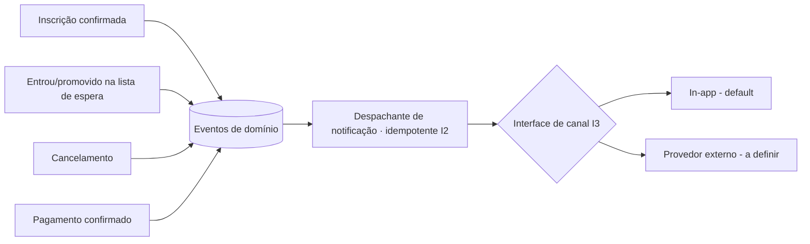

# SPEC-007 — Notificações e comprovantes

> Autores: **Diego (Sistemas)** coordena · **Murilo (Eventos)** no despacho · Laura classificou.
> Tamanho: **Grande** · Transversal — consome eventos de outras SPECs.

## Contexto e problema

Participantes querem receber um comprovante logo após a inscrição, e vários fluxos (lista de espera, promoção, cancelamento, confirmação de pagamento) dependem de avisar o usuário. A elicitação deixou o **canal de envio em aberto (#5)**. Esta SPEC define **o que** notificar e **quando**, mantendo o **canal desacoplado** (interface plugável) para não travar as demais SPECs enquanto o provedor não é escolhido.

## Objetivo

Entregar notificações e comprovantes aos participantes nos momentos-chave, com o canal de entrega abstraído atrás de uma interface.

## Não-objetivos

- Escolha do provedor concreto (e-mail/SMS/push) — **decisão em aberto**; nesta SPEC o canal é uma interface com implementação mínima (ex.: in-app) até o provedor ser definido.
- Marketing/campanhas — só notificações transacionais.

## Invariantes

- **I1:** toda notificação nasce de um evento de domínio real (inscrição, promoção, cancelamento, pagamento) — não há notificação inventada.
- **I2:** o disparo é **idempotente**: o mesmo evento não gera notificação duplicada.
- **I3:** a lógica de negócio não conhece o canal concreto — depende só da interface de notificação.

## Diagrama

## Requisitos rastreáveis

| ID | Requisito | Prioridade | Critério de aceite | Status | Verificação |
|---|---|---|---|---|---|
| NOT-01 | Como participante, quero um comprovante logo após me inscrever, para confirmar que deu certo. | P1 | WHEN uma inscrição é confirmada THEN o sistema SHALL gerar um comprovante com evento, participante, status e data. | Pendente | — |
| NOT-02 | Como participante, quero ser avisado ao entrar e ao ser promovido na lista de espera, para agir no prazo. | P1 | WHEN o participante entra na fila OU é promovido THEN o sistema SHALL notificá-lo (a promoção inclui o prazo de confirmação). | Pendente | — |
| NOT-03 | Como participante, quero ser avisado do cancelamento da minha inscrição, para ter registro. | P2 | WHEN uma inscrição é cancelada THEN o sistema SHALL notificar o participante. | Pendente | — |
| NOT-04 | Como participante, quero ser avisado da confirmação do meu pagamento, para saber que minha vaga está garantida. | P2 | WHEN um pagamento é confirmado THEN o sistema SHALL notificar o participante. | Pendente | — |
| NOT-05 | Como equipe de TI, quero o canal de entrega desacoplado, para trocar de provedor sem mexer na regra. | P1 | WHEN o provedor de canal muda THEN a lógica de negócio SHALL permanecer inalterada, dependendo só da interface (I3). | Pendente | — |
| NOT-06 | Como equipe de TI, quero disparo idempotente, para não enviar notificação duplicada. | P1 | WHEN o mesmo evento de domínio é processado mais de uma vez THEN o sistema SHALL enviar no máximo uma notificação (I2). | Pendente | — |

## Plano de implementação

> Bloqueio: T0 (stack) precede implementação. Gates `<a definir>`.

| Tarefa | Agente | Requisito(s) | Arquivos/áreas | Depende de | Done when | Gate |
|---|---|---|---|---|---|---|
| T1 | [Diego] → [Lucas] | NOT-05 | interface de canal + impl in-app | SPEC-001/T0 | Interface de notificação com implementação in-app default (I3). | `<a definir>` |
| T2 | [Murilo] → [Lucas] | NOT-01..04, NOT-06 | despachante idempotente (outbox) | T1 | Consome eventos de domínio e despacha uma vez (I2). | `<a definir>` |
| T3 | [Lucas] | NOT-01 | geração de comprovante | T2 | Comprovante de inscrição com dados corretos. | `<a definir>` |
| T4 | [Renata] | NOT-06 | observabilidade de entrega | T2 | Métrica/log de enviados, duplicados evitados, falhas. | `<a definir>` |
| T5 | [Ricardo] | NOT-01..06 | testes | T2–T3 | Cada gatilho notifica uma vez; troca de canal não quebra regra. | `<a definir>` |

## Matriz de testes

| Requisito | Tipo | Responsável | Comando/gate | Evidência esperada |
|---|---|---|---|---|
| NOT-01 | integration | [Ricardo] | `<a definir>` | Inscrição gera comprovante correto. |
| NOT-02 | integration | [Ricardo] | `<a definir>` | Entrada e promoção notificadas. |
| NOT-05 | unit | [Ricardo] | `<a definir>` | Regra depende só da interface (mock de canal). |
| NOT-06 | integration | [Ricardo] | `<a definir>` | Evento repetido → 1 notificação. |

## Riscos e mitigações

| Risco | Mitigação |
|---|---|
| Escolher canal cedo demais e acoplar | Interface plugável (I3); default in-app até decidir provedor. |
| Notificação duplicada em retries | Padrão outbox + idempotência (Murilo, I2). |
| Notificação sensível (dado pessoal) por canal externo | Minimizar conteúdo; alinhar com LGPD ao definir provedor. |

## Perguntas abertas

- **Q-01 (bloqueante p/ entrega externa):** qual **canal/provedor** de notificação (e-mail? SMS? push?) — Pare e Pergunte (integração externa sem provedor). Até lá, só in-app.

## Validação

`/kairos-forge:validar SPEC-007`

## Próximo passo

`/kairos-forge:mobilizar SPEC-007` (a interface pode ser construída antes de escolher o provedor externo).
